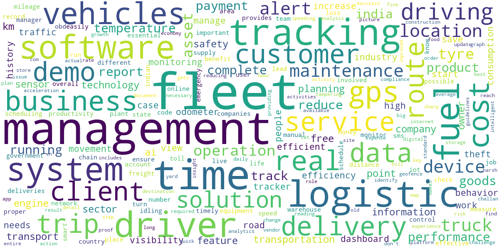

# Blog topic classifier
## Develop NLP-based classifier to predict the blog topic

Blogs, posts, articles, etc. are published constantly by various authors in different **genres**. This blog authorship corpus dataset comprises of **681,288 posts** from **19,320 bloggers**. Given a text, the task is to create a multi label classifier that could predict the topic the blogger intends to write without knowing about him/her. 

## ML libraries/Architectures
NLTK, Gensim (Word2Vec), Scikit-learn (CountVectorizer, TfidfVectorizer), TensorFlow, Keras, MultinomialNB, RandomForestClassifier, Embedding, LSTM